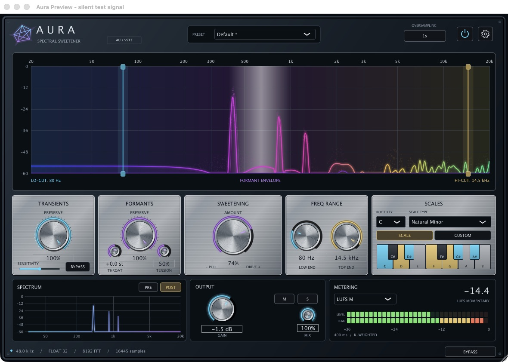
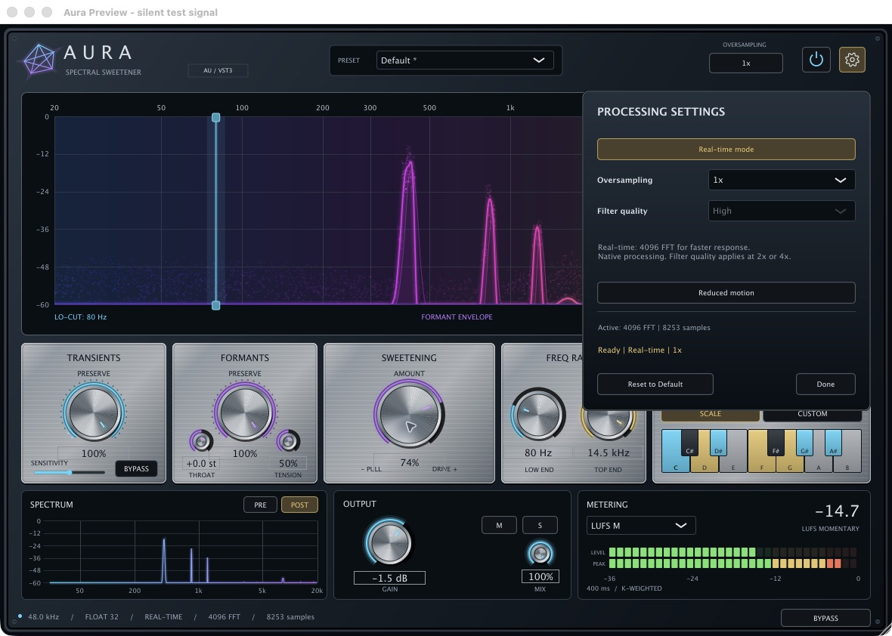

# Aura 2.0

## Install Aura — start here

Download from the [official Aura 2.0 release](https://github.com/Retroalligator/Aura/releases/tag/v2.0.0).
Close your DAW before installing or replacing the plug-in.
When updating, replace Aura in its existing location and keep only one copy of
each plug-in format installed.

| Your computer | Download | Includes |
|---|---|---|
| macOS 11+ · Apple Silicon or Intel | [Aura-2.0.0-Universal.dmg](https://github.com/Retroalligator/Aura/releases/download/v2.0.0/Aura-2.0.0-Universal.dmg) | AU for Logic Pro and AU hosts; VST3 for VST3 hosts |
| Windows 10/11 · x64 | [Aura-2.0.0-Windows-x64-Setup.exe](https://github.com/Retroalligator/Aura/releases/download/v2.0.0/Aura-2.0.0-Windows-x64-Setup.exe) | VST3 plug-in and optional standalone app |

**Security prompts:** Windows builds are unsigned. macOS builds have an ad-hoc
signature, but no Apple Developer ID or notarization, so macOS cannot verify the
publisher. Approve only the Aura files downloaded from this repository. Use the
[checksum check below](#verify-your-download) before making a security exception.

### macOS installation

1. Open the downloaded DMG. If macOS blocks it, follow **macOS security approval** below, then open it again.
2. In Finder, press **Command + Shift + G** and open `~/Library/Audio/Plug-Ins/`.
   Create the `Components` and `VST3` folders there if needed. If the parent folder
   is missing, create it in `~/Library/Audio/` first.
3. Copy the **whole bundles** from the DMG into these folders:

   | Bundle | Destination for your user account |
   |---|---|
   | `Aura.component` | `~/Library/Audio/Plug-Ins/Components/` |
   | `Aura.vst3` | `~/Library/Audio/Plug-Ins/VST3/` |

   Logic Pro needs the AU (`Aura.component`). Install VST3 if your DAW uses VST3.
   For installation for all users instead, drag each bundle onto the matching
   **Install AU Here** / **Install VST3 Here** shortcut in the DMG; macOS may ask
   for an administrator password. Those shortcuts use `/Library/Audio/Plug-Ins/`.
4. Eject the DMG, reopen your DAW, and rescan plug-ins. Load **Aura** as an audio
   effect under **AudioStudio**. In Logic Pro, use an **Audio FX** slot →
   **Audio Units → AudioStudio → Aura**.

#### macOS security approval

If macOS says the developer cannot be verified or Apple cannot check Aura for
malicious software, dismiss the warning, open **System Settings → Privacy &
Security**, and look for the blocked Aura download or plug-in. Choose **Open
Anyway**, authenticate if requested, then confirm **Open**. Retry opening the
DMG or scanning Aura. On older macOS versions, this panel is named **System
Preferences → Security & Privacy**.
[Apple's security approval instructions](https://support.apple.com/en-us/102445).

**If the installed plug-in is still blocked during scanning and there is no
Open Anyway option:** quit your DAW and open Terminal. After verifying the
download, run only the line for each format you installed. These commands remove
the downloaded-file quarantine flag from the named Aura bundle only:

```sh
xattr -dr com.apple.quarantine "$HOME/Library/Audio/Plug-Ins/Components/Aura.component"
xattr -dr com.apple.quarantine "$HOME/Library/Audio/Plug-Ins/VST3/Aura.vst3"
```

If you used the DMG's **all-users shortcuts**, use these paths instead:

```sh
sudo xattr -dr com.apple.quarantine "/Library/Audio/Plug-Ins/Components/Aura.component"
sudo xattr -dr com.apple.quarantine "/Library/Audio/Plug-Ins/VST3/Aura.vst3"
```

The `sudo` commands may request your Mac password; Terminal does not display
characters as you type it. A missing-path message means Aura is not installed
at that location. Reopen the DAW and rescan afterward. Keep Gatekeeper and SIP
enabled; do not run quarantine-removal commands against Downloads, your whole
plug-in folder, or your DAW.

In Logic Pro, open **Logic Pro → Settings (or Preferences) → Plug-in Manager**,
select **Aura**, then choose **Reset & Rescan Selection**. Restart your Mac if a
new AU still does not appear.
[Apple's plug-in rescan guide](https://support.apple.com/en-us/122179).

### Windows installation

1. Run **Aura-2.0.0-Windows-x64-Setup.exe**. If **Windows protected your PC**
   appears for this verified Aura download, select **More info → Run anyway**.
   **Unknown publisher** is expected for this unsigned build.
   [Microsoft's SmartScreen guidance](https://learn.microsoft.com/en-us/windows/apps/package-and-deploy/publish-first-app#step-6-handle-smartscreen-for-new-apps).
2. Approve the Windows administrator prompt for the Aura installer. Keep the
   **VST3 plug-in** selected; the **Standalone application** is optional.
   Finish the installer. Default locations are:

   | Component | Default destination |
   |---|---|
   | VST3 | `C:\Program Files\Common Files\VST3\Aura.vst3` |
   | Optional standalone app | `C:\Program Files\Aura\Aura.exe` |

3. Reopen your DAW and rescan its VST3 plug-ins. Load **Aura / AudioStudio** on
   an audio-effect insert. Windows has no AU version. The standalone app needs
   an audio input and output device; the separate downloadable
   `Aura-2.0.0-Windows-x64.exe` is the app, **not the installer**.

**File-specific unblock:** if Windows marks the downloaded Setup EXE or portable
ZIP as blocked, right-click that file → **Properties → General → Unblock →
Apply**, if offered. For a ZIP, do this **before** using **Extract All**.
[Microsoft's file-unblocking documentation](https://learn.microsoft.com/en-us/powershell/module/microsoft.powershell.utility/unblock-file).

**Portable VST3:** download the
[Windows ZIP](https://github.com/Retroalligator/Aura/releases/download/v2.0.0/Aura-2.0.0-Windows-x64.zip),
extract it, and copy the entire `Aura.vst3` directory to
`C:\Program Files\Common Files\VST3\` (administrator permission may be required).
Then rescan your DAW. Do not copy just the file inside the bundle.

<details>
<summary>Windows 11: Smart App Control blocks Aura, or Run anyway is missing</summary>

Smart App Control is separate from SmartScreen and has **no per-app exception**.
If it specifically blocks the verified unsigned Aura build on your personal PC,
the system-wide opt-out is **Windows Security → App & browser control → Smart
App Control settings → Off**. This removes Smart App Control protection for
**all apps**, not just Aura; it is not required for a normal SmartScreen prompt.
Keep Microsoft Defender Antivirus enabled. Re-enabling Smart App Control
depends on your installed Windows version; consult
[Microsoft's current FAQ](https://support.microsoft.com/en-us/windows/security/threat-malware-protection/smart-app-control-frequently-asked-questions)
before changing it.

If a work/school administrator or application-control policy blocks installation,
contact the administrator for an approved installation. A SmartScreen prompt
with no **Run anyway** option does not always mean Smart App Control is the cause.
Unblocking a file does not override these policies.

</details>

### Verify your download

Download [SHA256SUMS.txt](https://github.com/Retroalligator/Aura/releases/download/v2.0.0/SHA256SUMS.txt)
from the same release. Calculate the hash of your downloaded file:

macOS Terminal:

```sh
shasum -a 256 "$HOME/Downloads/Aura-2.0.0-Universal.dmg"
```

Windows PowerShell:

```powershell
Get-FileHash "$HOME\Downloads\Aura-2.0.0-Windows-x64-Setup.exe" -Algorithm SHA256
```

Compare the result with the entry for that exact filename in `SHA256SUMS.txt`
(uppercase/lowercase hex letters are equivalent). If it differs, download again
and do not approve or run that copy. If your antivirus reports detected malware,
or macOS reports damage, stop and report the exact message through
[GitHub Issues](https://github.com/Retroalligator/Aura/issues); these instructions
are for unsigned-publisher/download prompts, not malware detections.

To uninstall, remove the Aura bundles you copied on macOS, or use
**Settings → Apps → Installed apps → Aura → Uninstall** on Windows. For a portable
installation, remove its copied Aura files.

## About Aura

Aura is an open-source spectral sweetening and harmonic snapping effect built
with C++20 and JUCE 8.0.15. It runs as Universal 2 AU/VST3 on macOS and x64
VST3/standalone on Windows, under the AGPL-3.0-only license.



*Native macOS editor with the silent synthetic preview signal.*

- **Mid/Side processing:** choose Stereo, Mid only, Side only, or Mid + Side.
  Separate Mid and Side blends control processing of the centre and width;
  unselected components remain latency-aligned dry.
- **Delta audition:** LISTEN DELTA plays only the difference between the selected
  processing result and aligned dry, before output gain. Mix scales the difference.
- **Tonic and scales:** all 12 root keys, eight scale choices including Custom,
  and an interactive 12-note keyboard. Custom intervals transpose with the root.
- **Sweetening:** AMOUNT pulls partials toward enabled notes and smoothly raises
  the wave, particle, and formant-curve color saturation.
- **Transient preservation:** median HPSS and onset detection route estimated
  percussion around harmonic pitch processing. PRESERVE, SENSITIVITY and a
  transient-preservation BYPASS control this split.
- **Formant preservation:** cepstral envelopes retain broad timbre. PRESERVE
  reapplies the envelope; THROAT shifts its shape and TENSION changes its detail.
- **Interactive range:** drag glowing LO-CUT/HI-CUT handles or use LOW END/TOP END.
- **Output:** latency-aligned Mix, output gain and global BYPASS.
- **Factory sounds:** Default, Vocal Magic, 808 Tuner, Lush Pad Sweetener,
  Drum Transient Preserver; edited-state indicators and host state recall.
- **Processing settings:** 1x/2x/4x oversampling, Standard/High anti-alias filter
  quality, and Real-time 4096 or Studio 8192 FFT analysis.
- **Visualizer:** logarithmic 20 Hz–20 kHz and 0 to −60 dB grid, glowing particle
  trails, cepstral envelope and transient flashes, with Reduced motion available.
- **Accessibility:** named dropdown choices, keyboard note states, editable knob
  values and keyboard interaction.

Aura 2.0 removes the header power button, auxiliary lower SPECTRUM analyzer,
metering, and output Mute/Solo buttons. The main visualizer remains, and the new
Mid/Side and Delta rack occupies the freed space.



[Download installers and complete source](https://github.com/Retroalligator/Aura/releases/tag/v2.0.0)

- **macOS:** `Aura-2.0.0-Universal.dmg` contains Universal 2 AU and VST3 plugins.
- **Windows:** `Aura-2.0.0-Windows-x64-Setup.exe` installs VST3 and an optional
  standalone app. `Aura-2.0.0-Windows-x64.exe` is the standalone app; the portable
  ZIP also includes the VST3 bundle and notices.
- The complete-source archive includes the exact pinned JUCE source.
  Release assets include CI evidence and SHA-256 checksums.

This is a development pre-release. macOS payloads are ad-hoc signed and not
notarized; Windows executables are unsigned. See [validation](VALIDATION.md)
for actual checks and timing limits.

## GitHub Packages

The verified release bundle is also published as
`ghcr.io/retroalligator/aura:2.0.0` in GitHub Packages. It contains the native
installers, complete source and checksums under `/aura`. See
[package extraction instructions](Packaging/registry/README.md).
Use the DMG or Setup EXE from Releases for normal installation.

## Mid/Side and Delta

Stereo processes left and right independently. The other modes encode
`Mid = (L + R) / 2` and `Side = (L − R) / 2` before the spectral engine, then
reconstruct `L = Mid + Side`, `R = Mid − Side`.

| Mode | Mid | Side |
|---|---|---|
| Stereo | Left/right processing; Mid/Side blends inactive | |
| Mid only | Processed, scaled by Mid blend | Original aligned Side |
| Side only | Original aligned Mid | Processed, scaled by Side blend |
| Mid + Side | Processed, scaled by Mid blend | Processed, scaled by Side blend |

Mid and Side percentages blend each processed component with its aligned dry
component; 0% leaves it unchanged, 100% applies the full effect. AMOUNT controls
pitch pull inside the engine, and the global Mix then blends the reconstructed
result with dry. Both components share the scale, range, transient and formant
settings. In mono, the input is Mid; Side-only passes dry and its Delta is silent.

LISTEN DELTA subtracts aligned dry from the result after the component blends
and global Mix, before output gain. Output gain also controls audition level.
For example, with Mid-only selected, Delta contains only changes to the centre;
the original stereo width cancels. Mix 0% gives silence in Delta. It includes
changes from the selected oversampling filters, not only pitch changes.
Global BYPASS and host bypass restore aligned dry at unity gain, overriding
Delta and output gain.

Branch blends and Delta transitions are smoothed over 25 ms. Switching between
Stereo and a Mid/Side mode changes the engine's input basis: output fades down
for 25 ms, the active engine restarts and primes in silence, then fades up over
25 ms. It keeps the same host latency. Switching among the three Mid/Side modes
only changes the smoothed branch selection. Choose the channel basis before
playback or bounce; the saved channel preference is nonautomatable.

## Controls and saved sessions

ROOT KEY beside SCALE TYPE transposes any preset or custom interval pattern
through all 12 pitch classes, with A4 = 440 Hz. Clicking a keyboard key copies
the current preset to Custom; custom notes are stored relative to the tonic.
An empty custom scale preserves pitch. Double click a knob to restore its default.

The factory preset manager recalls all 25 parameters; an asterisk marks edits.
Factories start in Stereo with normal audition and Studio analysis. Settings
opens from the gear or factor indicator. Reduced motion, Reset to Default, and
Done are in the same panel. The bottom description shows active resolution and
delay, while Mid/Side shows a pending basis switch.

Output gain spans −24 to +12 dB. Global BYPASS returns aligned dry at unity gain.
The old `outputMute` and `soloWet` parameter IDs and their behavior remain for
v1 session/automation compatibility, but their buttons are removed. Reset to
Default clears these legacy states. All original IDs, ordering and AU version
hints remain intact. v1 states without the new routing parameters restore
Stereo, Mid/Side blends at 100%, and Delta off. The new IDs `channelMode`,
`midAmount`, `sideAmount`, `deltaListen` use AU version hint 7.

Legacy Boolean `oversampling` automation still selects 1x/4x. States without
`oversamplingMode` migrate this Boolean, and missing quality defaults to High.
Missing `realTimeMode` selects Studio. Host state retains the factory identity
and edited values.

## Processing settings and latency

| Analysis | Native FFT / hop | Host delay | Delay at 48 kHz | Bin spacing at 48 kHz |
|---|---|---|---|---|
| Studio | 8192 / 2048 | 16445 samples | 342.6 ms | 5.859375 Hz |
| Real-time | 4096 / 1024 | 8253 samples | 171.9 ms | 11.71875 Hz |

Both modes use periodic Hann windows, 75% overlap, four HPSS lookahead frames
and 61 samples of FIR alignment. Real-time halves spectral buffering; it still
has latency. Wet, dry, Mid/Side and Delta use the active bank's aligned delay.

At 1x/2x/4x, internal FFT sizes are 8192/16384/32768 in Studio and
4096/8192/16384 in Real-time. The sample rate scales with the FFT, retaining each
bank's physical analysis duration and frequency resolution. Standard uses
shorter anti-alias filters; High uses steeper filters. Quality is disabled at 1x
and retained for the next resampled mode.

Oversampling changes prime the incoming path before a 50 ms crossfade, with
unchanged host delay. Resolution changes prime, fade output down, notify the
host outside the callback, and fade up after acknowledgement. This briefly
interrupts audio; choose resolution before playback or bounce. All ten paths
are allocated before callbacks. Parameter reads and FIFO transport are atomic;
callbacks use fixed storage and make no host latency notifications.

HPSS uses a centred nine-frame temporal median and 17-bin frequency median,
with complementary soft masks and a fast/slow onset detector. The estimated
percussive component bypasses harmonic phase processing and envelope correction
using original complex bins. Cepstral liftering estimates a broad spectral
envelope from log magnitudes; processing reapplies the input/processed envelope
ratio, scaled by Formants Preserve. THROAT shifts the target envelope by ±12
semitones and TENSION adjusts the 0.5–2 ms lifter cutoff.

The split and envelope are estimates. Overlapping pitched attacks, drums and
noise can share the masks; broad cepstral shape is not an anatomical measurement.
The selected frequency range is a processing boundary, not a brick-wall filter.
Functional tests do not certify listening transparency or every host's deadlines.

## Build

Requires macOS, Apple command line tools or Xcode, CMake 3.24+, Python 3 and
internet access for the first pinned JUCE fetch. No Projucer project is required.

```sh
cmake -S . -B build -DCMAKE_BUILD_TYPE=Release
cmake --build build --parallel 4
ctest --test-dir build --output-on-failure
./build_and_package.sh
```

Universal 2 is the default, targeting macOS 11.0+. Bundles appear in
`build/Aura_artefacts/Release/AU` and `VST3`. Packaging builds, tests, verifies both
architectures, ad-hoc signs and creates `dist/Aura-2.0.0-Universal.dmg`.
Override paths with `AURA_BUILD_DIR`/`AURA_DIST_DIR` and parallelism with
`AURA_JOBS`. `AURA_PACKAGE_ONLY=1` repackages an already tested Release build;
`AURA_STYLE_DMG=0` skips optional Finder styling in headless CI.

For silent GUI review, configure with `-DAURA_BUILD_PREVIEW=ON`, build
`AuraPreview`, then open `Aura Preview.app`. Synthetic harmonics and recurring
broadband hits drive its display without an audio device or microphone access.
This developer harness is not packaged.

### Windows

Requires Windows 10+, Visual Studio 2022 Desktop development with C++, CMake
3.24+ and Inno Setup 6 or 7. Run `./build_windows.ps1` in PowerShell.
It builds x64 VST3, standalone and regressions, then packages the Setup EXE and
portable ZIP. VST3 installs under `C:\Program Files\Common Files\VST3`; the
optional app under `C:\Program Files\Aura`. The standalone effect needs an audio
input/device; use VST3 inside a Windows DAW. Windows produces no Audio Unit.

### Install and validate

Copy `Aura.component` to `~/Library/Audio/Plug-Ins/Components` and `Aura.vst3` to
`~/Library/Audio/Plug-Ins/VST3`, or use the system-wide folders linked in the DMG.
Restart the host and rescan. Aura is an effect under AudioStudio.

```sh
auval -v aufx Aura AS01
arch -x86_64 auval -v aufx Aura AS01
```

The second command requires Rosetta. See VALIDATION.md for current checks.
No additional FL Studio work is performed. Direct DAW listening and project
recall are not implied by AU validation.

## Source and license

- `Source/SpectralProcessor.*`: STFT, HPSS, snapping, phase locking and synthesis.
- `Source/CepstralEnvelope.h`: fixed-storage cepstral projection and median helpers.
- `Source/PluginProcessor.*`: parameters, LR/MS routing, Delta, aligned output,
  resolution/path transitions, smoothing, programs and state.
- `Source/ProcessingPaths.h`: native and FIR-resampled paths for both resolutions.
- `Source/PluginEditor.*`: control pods and Mid/Side/Delta rack.
- `Source/SpectralVisualizer.*`, `KeyboardSelector.*`, `SettingsPanel.h`: displays
  and processing controls; OpenGL-backed vector painting with a software fallback.
- `Tests/TestMain.cpp`: processor and DSP regressions, including M/S isolation,
  Delta reconstruction, mono, migration and live basis changes.
- `Packaging/` and `.github/workflows/`: installers and release CI.

Aura is AGPL-3.0-only; JUCE 8 modules use their AGPLv3 option. The complete-source
release archive includes the exact dependency and notices. CMake uses
`vendor/JUCE` when present. See LICENSE and THIRD_PARTY_NOTICES.md. A closed-source
JUCE product may require a [commercial JUCE license](https://juce.com/legal/juce-8-licence/).

Algorithm background: [Röbel and Rodet, DAFx 2005](https://www.dafx.de/paper-archive/2005/P_030.pdf).
Aura uses a single-pass lifter rather than their iterative true-envelope method.

Publishing a tagged release builds/tests macOS and Windows, validates the
packaged AU, exercises Windows install/uninstall, and uploads installers,
complete source, evidence and checksums. Only the final publish job receives
repository write permission.
