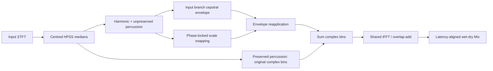

# Aura 1.5

[Download installers and complete source](https://github.com/Retroalligator/Aura/releases/tag/v1.5.0)

- macOS: `Aura-1.5.0-Universal.dmg` includes Universal 2 AU and VST3 plugins.
- Windows: `Aura-1.5.0-Windows-x64-Setup.exe` installs VST3 and an optional standalone app.
- `Aura-1.5.0-Windows-x64.exe` is the standalone app; the portable ZIP also includes the VST3 bundle and notices.

This is a development release. macOS installers are ad-hoc signed and not
notarized; Windows executables are unsigned. See VALIDATION.md for actual checks.
Windows mode-change callbacks exceeded the 512-sample / 48 kHz deadline on the
initial CI runner; start with 1x and check your host CPU/buffer settings. See
[the Windows evidence](Validation/public-release/WINDOWS.md).


An open-source macOS AU v2 / VST3 and Windows x64 VST3 / standalone spectral harmony effect built with C++20 and JUCE 8.0.15.
Choose **ROOT KEY** beside **SCALE TYPE** in the SCALES pod to transpose any preset
or custom scale through all 12 pitch classes, with A4 = 440 Hz. The keyboard highlights the resulting
notes in gold and cyan. Clicking a key copies the current preset into Custom;
custom notes are stored as intervals from the tonic and transpose with it.
C is the default, preserving the meaning of older saved states.

The header preset manager recalls **Default**, **Vocal Magic**, **808 Tuner**,
**Lush Pad Sweetener**, and **Drum Transient Preserver**. Each factory program
recalls all 20 parameters, including root, scale, range, output routing,
oversampling factor, and resampling quality. An asterisk marks edits to the
selected program. The header's factor indicator and Settings button open
**PROCESSING SETTINGS**; Power and the lower BYPASS button control the same
bypass parameter.

Processing Settings offers **1x**, **2x**, and **4x**, plus **Standard** or **High**
resampling filter quality. Standard uses shorter anti-alias filters; High uses
steeper filters for greater alias rejection. Quality is disabled at 1x and its
selection is retained for the next resampled mode. Reduced motion, Reset to
Default, and Done are in the same panel. Changes apply when audio runs: the
incoming path is primed before its output fades in, and the panel shows the
pending status.

Amount pulls spectral peaks toward the nearest enabled note and progressively
increases the main visualizer's color saturation. Mix blends processed
and latency-aligned dry audio. Drag the glowing LO-CUT / HI-CUT handles or use
LOW END / TOP END to set the active sweetening range. An empty custom scale
preserves pitch. Double click a knob to restore its default.

The five brushed-steel control pods provide:

- **TRANSIENTS:** PRESERVE routes estimated percussion into an original-phase
  bypass. SENSITIVITY biases HPSS classification; its BYPASS disables preservation.
- **FORMANTS:** PRESERVE reapplies the input branch's spectral envelope. THROAT
  shifts the envelope shape by ±12 semitones; TENSION changes its detail.
- **SWEETENING:** the oversized AMOUNT knob controls pitch pull and the main
  spectrum's color intensity.
- **FREQ RANGE:** LOW END and TOP END set the effect boundaries.
- **SCALES:** side-by-side ROOT KEY and SCALE TYPE dropdowns, SCALE / CUSTOM,
  and a 12-note piano keyboard.

The lower rack includes a PRE / POST analyzer, output gain (-24 to +12 dB), Mix,
Mute, and Solo. Solo auditions the fully processed signal while retaining the Mix
setting. Global BYPASS restores latency-aligned dry at unity gain, overriding
output gain, Mute, and Solo. All audio transitions are smoothed.

Older states retain their parameter IDs, AU version hints, and prior defaults.
The legacy `oversampling` Boolean retains version hint 4 and its off default;
legacy automation still selects 1x or 4x. The appended `oversamplingMode` and
`processingQuality` choices use version hint 5. States without a mode choice
migrate the old Boolean to 1x or 4x, and missing quality defaults to High.
Factory program identity is stored alongside the parameter state; edited values
remain intact when reopening a session.

The meter offers 400 ms momentary LUFS, channel-averaged RMS, and sample peak
retained over 400 ms. LUFS uses K weighting and sums channel energy; this is not
an integrated or true-peak meter. POST analyzes both final output channels by
averaging their spectral power, so opposite-polarity stereo does not cancel.

## Build

Requires macOS, Apple command line tools (or Xcode), CMake 3.24+, Python 3, and an
internet connection for the first JUCE fetch. No Projucer project is required.

```sh
cmake -S . -B build -DCMAKE_BUILD_TYPE=Release
cmake --build build --parallel 4
ctest --test-dir build --output-on-failure
./build_and_package.sh
```

Both `arm64` and `x86_64` are built by default, targeting macOS 11.0+.
Bundles are in `build/Aura_artefacts/Release/AU` and `VST3`. The packaging script
does a clean Release build, runs the tests, verifies both architectures, ad-hoc
signs and verifies the bundles and disk image, and creates `dist/Aura-1.5.0-Universal.dmg`.
Override build paths with `AURA_BUILD_DIR` / `AURA_DIST_DIR`, and parallelism
with `AURA_JOBS`. `AURA_STYLE_DMG=0` skips optional Finder styling in a headless
session; the installation guide remains included.
Set `AURA_PACKAGE_ONLY=1` to repackage an existing, already tested Release build.
Finder layout generation uses Python 3 and two pinned packages in a build-local venv.

For a silent GUI/DSP review without an audio device, configure with
`-DAURA_BUILD_PREVIEW=ON`, build target `AuraPreview`, and open the generated
`Aura Preview.app`. Its synthetic harmonic signal and recurring broadband hits drive the visualizer without
playing sound or requesting microphone access. This harness is not packaged.

## Windows build and install

Requires Windows 10 or newer, Visual Studio 2022 with Desktop development with
C++, CMake 3.24+, and Inno Setup 6 or 7. In PowerShell:

```powershell
./build_windows.ps1
```

The script builds x64 VST3, the standalone `Aura.exe`, and the regression suite,
runs the tests, then creates the setup EXE and portable ZIP in `dist/`.
The setup installs the VST3 bundle under `C:\Program Files\Common Files\VST3`
and the optional standalone app under `C:\Program Files\Aura`.
A standalone effect needs an audio input/device to process; it does not load DAW projects.
Use VST3 for a Windows DAW. No Audio Unit is produced on Windows.
GitHub Actions builds/tests on a Windows 2022 runner and exercises installation
and uninstallation on that disposable runner. This does not certify Windows
hardware/audio drivers or listening performance in a DAW.

## Install and validate

Copy `Aura.component` to `~/Library/Audio/Plug-Ins/Components`, and `Aura.vst3`
to `~/Library/Audio/Plug-Ins/VST3`. System-wide folders under `/Library` also
work. Restart the host and rescan. Aura is an effect under AudioStudio.

```sh
auval -v aufx Aura AS01
arch -x86_64 auval -v aufx Aura AS01  # requires Rosetta
```

In Logic Pro, verify Aura in Plug-in Manager, then insert it on an audio track.
See `VALIDATION.md` for version-specific results and verification limits. The v1.5 release passes native and Rosetta regression/AU validation plus AU
pluginval at strictness 10 with GUI tests enabled. Evidence from earlier releases
applies to those recorded versions. Direct Logic playback has not been verified.
Further FL Studio work was stopped at the user's request. Current host validation
uses AU independently of that host; the VST3 payload is built and packaged.

The bundles and DMG are ad-hoc signed for development distribution. No Developer
ID certificate is available in this environment, and the deliverable is not
notarized. For normal Gatekeeper approval of an online release, use Developer ID
signing and Apple notarization.
Aura is licensed **AGPL-3.0-only**; see LICENSE and THIRD_PARTY_NOTICES.md.
JUCE 8 modules are used under their AGPLv3 option for this release. The complete-
source release archive includes the exact JUCE dependency and all its notices;
CMake automatically uses `vendor/JUCE` when present. Closed-source use of JUCE
may require a commercial [JUCE license](https://juce.com/legal/juce-8-licence/).
Dependency licenses are preserved in `ThirdParty/` and the dependency source.

## Engine

`SpectralProcessor` uses a periodic Hann analysis/synthesis window, an **8192-point
complex FFT**, and **2048-sample hops** (75% overlap). Four window-square overlaps sum to 1.5, so
the synthesis gain is 2/3. HPSS stores nine magnitude/complex frames. A centred nine-frame temporal median
estimates harmonic energy, and a 17-bin frequency median estimates percussive
energy. Complementary squared soft masks split each bin. Four future frames add
8192 host samples of lookahead to the 8192-sample STFT delay: **16384 samples**
for the spectral engine. An additional 61 host samples align all five processing
paths and dry audio with the longest FIR resampler delay. The processor reports **16445 samples total**
(372.90 ms at 44.1 kHz; 342.60 ms at 48 kHz). This fixed delay is reported during
construction and preparation, stays constant during automation, and aligns wet,
percussive bypass, dry Mix, and host bypass. No host notification or latency
change is performed inside the callback.



PUNCH 0 sends the complete spectrum through sweetening. PUNCH 1 routes the
entire estimated percussive component around both phase synthesis and formant
correction. Intermediate values split that component linearly. The original
complex percussion bins are added after envelope correction and before the shared
IFFT/overlap-add. Because both branches use the same window and delay, this linear
sum is equivalent to summing separately synthesized branches at the output.

A fast/slow amplitude detector supplements the median masks: its fast envelope
uses a 0.5 ms attack and 5 ms release, while the slow envelope uses 30 ms.
Detected onsets boost percussive classification only for broad spectral energy;
SENSITIVITY also biases the median classification. HPSS is an estimate:
isolated broadband impulses reconstruct without smearing, but overlapping drums,
pitched attacks, and sustained noise can share both masks. PUNCH 100 does not
guarantee that every sample of an arbitrary drum recording is classified as
percussive. The finite STFT/lookahead tail is reported to the host.

At 2x the internal engine uses a 16384-point FFT and 4096-sample hops; at 4x it
uses a 32768-point FFT and 8192-sample hops. The resamplers use one or two
cascaded half-band FIR stages respectively. Both modes retain the native
8192-host-sample analysis window and frequency resolution (5.859375 Hz per bin
at 48 kHz). Source analysis stops at the host Nyquist; generated higher-frequency
bins pass through the downsampling low-pass filter. Standard and High select
different FIR filter designs at each factor. Original-phase percussion is
preserved within the resampled path, whose filtering can change its samples
relative to unfiltered input.

Five paths are preallocated: native, 2x Standard, 2x High, 4x Standard, and 4x
High. Only the active path processes audio in steady operation. During a change,
the incoming path is restarted on its own frame grid and runs alongside the
active one for the reported latency plus one analysis window before a 50 ms
crossfade. This keeps the outgoing audio in place during priming and avoids
continually processing every inactive path. The frame grids use different
offsets to distribute transform work during transitions. Mode and quality
changes retain the same reported host latency.

Instantaneous frequency comes from unwrapped phase differences after removing
the expected bin advance. Local spectral peaks own neighboring bins, and
identity phase locking preserves phase relationships within each peak's lobe.
Pitch distance is measured in semitones. Amount smoothly interpolates frequency
in the logarithmic pitch domain; a one-semitone boundary taper avoids a hard
frequency-range edge. Negative frequencies are restored by Hermitian symmetry.
The range is a spectral processing boundary rather than a brick-wall audio filter:
STFT leakage from attacks can cross it. See `VALIDATION.md` for measured startup
and steady-state behavior.

The full-input formant curve is estimated from the real, symmetric log-magnitude
spectrum. Audio correction uses the original input envelope of the sweetened
branch, after HPSS routing, so bypassed percussion is not counted twice. An
inverse transform produces the real cepstrum. Because the log spectrum is real
and even, the implementation uses a real forward FFT scaled by `1/N`, which is
equivalent to its normalized inverse transform. A symmetric rectangular lifter
retains quefrencies up to 0.5–2 ms, controlled by TENSION (1 ms at its neutral
setting), and a second real forward FFT recovers the
broad log envelope. A second envelope is extracted after snapping. Within the
active frequency range, FORMANTS PRESERVE applies
`exp(formantPreserve * (targetLogEnvelope - processedLogEnvelope))` to the
processed complex bins before the IFFT. THROAT samples the original envelope
on a shifted frequency axis to create the target; at its neutral setting, target
equals original. At 100% preservation, that is the full target/new
envelope ratio; at 0%, it applies no correction. The percussive complex bins
are added afterward, before synthesis. Correction runs when pitch or envelope shape changes.
A log floor 60 dB below the frame peak (with a 1e-9 minimum), silent-bin
exclusion, and a floating-point exponent guard avoid
log-zero and non-finite arithmetic. Zero spectral bins stay zero; boundary-limited
processing and sparse spectra can prevent an exact subsequent envelope match.

The full-input display envelope is computed only for the engine publishing UI
frames; audio correction independently extracts the routed input and processed
envelopes. The cepstral curve estimates broad spectral shape, rather than an
anatomical measurement. Dense overlapping partials can interfere. HPSS and
formant preservation improve these specific behaviors; commercial transparency
on arbitrary mixes still requires listening tests with real material.

## Real-time and UI

Large FFT engines, processor state, and FIFO storage are owned on the heap and
allocated during construction; their arrays and processing capacity remain fixed.
The macOS build requires JUCE's vDSP FFT backend; a compile-time guard prevents
using the allocating fallback for the large real transforms. Windows uses complex
cepstral transforms with two preallocated buffers instead of the portable real
transform's large temporary allocation. JUCE's fallback complex backend has a
private uncontended spin lock per FFT instance; instances are owned by the audio
path and are never shared with the editor. The callback reads
cached lock-free APVTS atomics and uses fixed arrays; it does
not access the ValueTree, allocate C++ objects, log, or notify the
message thread. Two bounded `juce::AbstractFifo` queues carry spectral frames and the actual
post-output FFT; full queues
drop new frames. Only the editor consumes the queue, and it is never reset while
the audio producer can be active. Mono and stereo matching bus layouts are supported.

The FIFO also carries the original cepstral envelope and actual bypass/correction
activity. Draining retains peak transient events across queued frames so brief hits
are not lost. A violet cubic spline overlays the input envelope; detected bypassed
hits produce a short white vertical flash. The TRANSIENTS and FORMANTS preservation knobs have LED rings driven
by bypassed spectral energy and energy-weighted log-envelope correction, rather
than just their knob positions.

The editor targets 60 Hz updates on a logarithmic 20 Hz–20 kHz grid spanning
0 to −60 dB. It interpolates magnitude displays and paints rainbow cubic curves,
up to 4096 data-driven particles, steel panels, and metallic rotary knobs with
colored indicators. New analysis frames arrive at the host sample rate divided
by 2048, rather than at the GUI timer rate. Actual frame pacing depends on the
host and graphics environment. The display holds its latest spectrum targets
between analysis frames; when callbacks stop, targets decay after the longer of
250 ms or three analysis hops. Actual silent frames still release the display.
The main wave, particle trails, and formant curve smoothly increase in color
saturation as AMOUNT rises. The hue palette stays consistent, and the lower
POST analyzer retains its fixed palette. This is visual feedback for sweetening
strength. Processing Settings offers Reduced motion, which disables particle
trails and transient flashes while retaining live spectrum and meter updates.
Anti-aliased vector graphics render through an attached `juce::OpenGLContext`. JUCE component painting also
provides the normal software path when no GL context is available. Every editable
parameter is automatable and serialized through APVTS. Custom keyboard changes
use host gestures and copy the current preset before switching to Custom.
The root, scale, factory, and processing settings dropdowns expose named choices to assistive clients
as well as retaining normal popup and keyboard selection.

The visual treatment follows the earlier attached steel-rack reference. The
separately named `image_b90fe6.jpg` and `watermarked_img_1704036837373526381.jpg`
were unavailable in this workspace, so this build does not claim a pixel-exact
match to those files. `UI_REVIEW.md` records the actual interface review.
Measured callback timing and AU validation belong in `VALIDATION.md`; passing
functional checks alone does not establish audio deadlines on every host or
commercial listening quality.

## Source map

- `Source/SpectralProcessor.*`: centred HPSS, onset detection, pitch mapping,
  phase locking, and shared synthesis of processed/original-phase branches.
- `Source/CepstralEnvelope.h`: fixed-storage cepstral projection and median helpers.
- `Source/PluginProcessor.*`: buses, path selection/priming, latency, parameters, smoothing,
  factory program recall, and state.
- `Source/ProcessingPaths.h`: fixed native/2x/4x processing and FIR resampling paths.
- `Source/FactoryPresets.h`: complete factory settings and parameter IDs.
- `Source/SpectrumFifo.h`: bounded SPSC transport and calibrated FFT display gain.
- `Source/OutputMonitor.h`: fixed-storage stereo post FFT and K-weighted loudness.
- `Source/RackDisplays.h`: auxiliary analyzer and segmented output meter.
- `Source/PluginEditor.*`, `SpectralVisualizer.*`, `KeyboardSelector.*`: UI.
- `Source/SettingsPanel.h`: oversampling/quality choices and processing status.
- `Source/AccessibleControls.h`: named-choice accessibility for the dropdowns.
- `Tests/TestMain.cpp`: deterministic signal and processor checks.
- `Packaging/`: installation graphics and DMG layout.

Algorithm background: [Röbel and Rodet, DAFx 2005](https://www.dafx.de/paper-archive/2005/P_030.pdf) discusses cepstral spectral-envelope estimation and preservation. Aura uses a bounded single-pass lifter rather than their iterative true-envelope estimator.

Reference APIs: [JUCE FFT](https://docs.juce.com/master/classjuce_1_1dsp_1_1FFT.html),
[APVTS](https://docs.juce.com/master/classjuce_1_1AudioProcessorValueTreeState.html),
[AbstractFifo](https://docs.juce.com/master/classjuce_1_1AbstractFifo.html).

Meter background: [EBU loudness metering](https://tech.ebu.ch/loudness/) and
[EBU Tech 3341](https://tech.ebu.ch/docs/tech/tech3341.pdf). The signal suite checks
stereo 1 kHz loudness at 44.1, 48, 96, and 192 kHz; it does not constitute full
EBU R128 certification.

Publishing a tagged GitHub release starts `.github/workflows/release.yml`. It
builds the Universal 2 macOS DMG and Windows x64 setup/standalone files, runs
regressions, checks the packaged AU and Windows install/uninstall, then uploads
all installers, complete corresponding source (with pinned JUCE), CI evidence,
and SHA-256 checksums. Only the final publish job receives repository write
permission. Unsigned development installers remain marked as previews.
